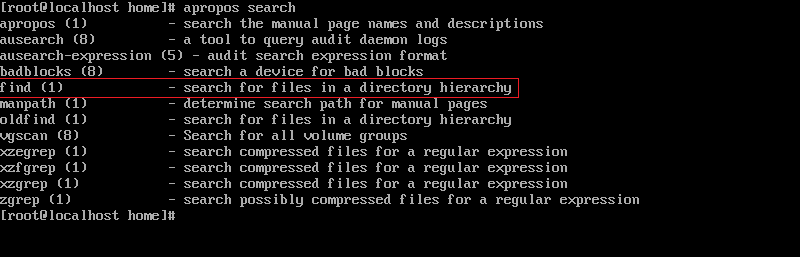
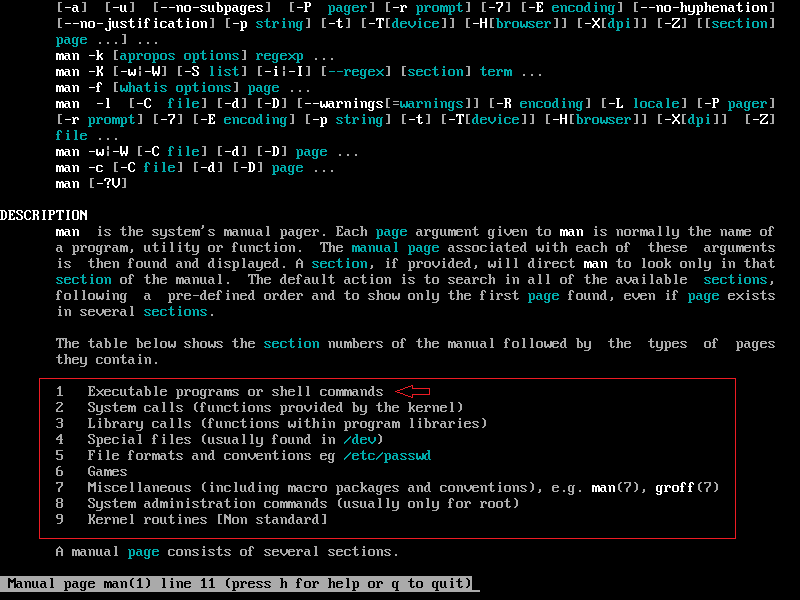
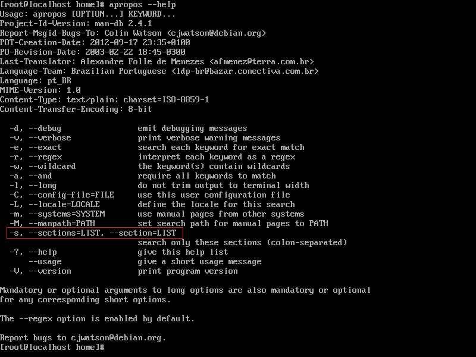
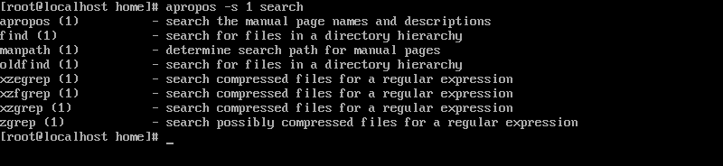

<h2 p align="center" > Localizar um texto em um diretório que não sabemos onde esta. </h2>

## Passo 1 - Localizando um comando com apropos.
 
 - O comando apropos serve para localizar um comando que você não lembra a sintaxe por meio de palavras-chave que descrevam a funcionalidade que este comando teria.   

 - Estamos procurando um comando que encontre uma pasta especifica.

 

 <i> - Dependendo do sistema precisa-se atualizar o cache para o comando apropos funcionar corretamente, o comando é <b>"mandb"</b></i>. 

 - Procuramos o comando find que localiza arquivos em uma hierarquia de diretórios.  
- Mas antes o que significa este <b>(1)</b> a frente do comando find?

 

 - Utilizando o comando <b>man man</b> (que seria o manual do próprio manual do linux), encontramos a descrição do tipo de função que determinada palavra teria caso tivesse determinado numero envolto do <b>()</b>.

 - Desta forma procuramos comandos executáveis, que correspondem ao número 1, que nosso comando <b>find</b> possui.

 - Por exemplo, poderíamos possuir os mesmos comandos derivativos do <b>find</b>, como <i>find-lib(5) find-ker(9)</i>, mas apenas precisamos obter comandos executáveis, para isso utilizaríamos a seguinte flag abaixo junto ao comando <b>apropos</b>.
 

<b><i> - Os comandos find-lib e find-ker não existem, apenas os mencionei a título ilustrativo.</b></i>

 

 - Utilizaremos a flag -s acompanhada do número da sessão que buscamos, nesse caso a sessão (1) destinada para comandos executáveis.

 - O comando ficaria: <b>apropos -s 1 search</b>

 

 - Note que a filtragem ficou relativamente menor, pois agora o <b>apropos</b> só nos passa a sessão que escolhemos. 

## Passo 2 - Utilizando o comando <b>find</b>  

 - Agora que sabemos qual comando utilizar para encontrar um arquivo ou diretório, vamos entender separadamente como construir um comando <b>find</b>.

 - Para este exemplo estamos procurando uma pasta chamada <b>arquivos</b>.

 - Não fazemos ideia de onde se localiza a pasta em questão, apenas sabemos seu nome e que ela é um diretório. Para localizá-la podemos utilizar o seguinte raciocínio: 

 - Para se encontrar uma caneta perdida em um quarto, primeiro precisamos entrar neste quarto. O comando <b>find</b> segue esta mesma analogia. 

 - Em sua sintaxe começamos com o comando <b>find</b> (diretório de pesquisa), no nosso exemplo, pegaremos desde o diretório / + a flag <b>-name</b> que será onde colocaremos o nome do diretório que estamos buscando, que por sua vez é o diretório <b>arquivos.</b>

 - Nosso comando então seria: <b>find / -name "arquivos"</b>

 

 - Aqui falaremos de dois pontos distintos, o primeiro é o caractere <b>"?"</b> e o segundo é a saída do nosso comando. 

 - O caractere </b>?</b>, podemos chamar de caractere coringa, ele tem a função de encontrar ou não qualquer caractere <b>somente</b> naquela posição. Por exemplo, caso tivéssemos a dúvida se a pasta se chama <b>"arquivos"</b> ou <b>"arquivo"</b> no singular, poderíamos utilizar o caractere coringa que nos daria qualquer carácter ou nenhum após a palavra <b>arquivo</b>. 

 - O segundo ponto é a saída do comando, notamos que temos dois resultados, mas por que isso? Porque deveríamos especificar o tipo de arquivo que queremos encontrar, caso contrário podemos tanto ter a saída de arquivos regulares, especiais ou diretórios. 

 - Para resolver isso é simples, basta passar a flag <b>-type</b> seguido do <b>parâmetro d</b> de "directory". 

 - Encontramos finalmente o nosso diretório, mas e se agora precisa-se ainda achar um trecho de texto de código dentro deste diretório que pudesse, por exemplo, ser um erro? 

## Passo 3 - Utilizando o comando <b>grep</b>  

 - O comando grep é a chave para esta busca, ele sozinho poderia resolver a nossa tarefa tanto através do caminho absoluto quanto do relativo. 

 <i> - Caminho absoluto é aquele que é declarado desde a raiz do sistema identificado pelo / até o local a onde deseja-se ir. </i> 

 <i> - Já o caminho relativo é aquele que parte do diretório que nos encontramos atualmente. </i> 

 - Neste exemplo criamos várias pastas e arquivos, e cada arquivo com seus textos dentro do diretório "/tmp/arquivos". Para localizar o arquivo em questão, escrevi em um desses documentos a palavra "<b>achou</b>". 

 - Podemos resolver este problema da seguinte forma: utilizando o comando <b>grep</b> + a flag -r (recursivo) + a palavra em questão "achou" + o caminho do diretório, absoluto ou relativo. 

 - Desta forma o nosso comando seria: <b>grep -r "achou" /tmp/arquivos/</b>

 - Poderíamos ter a solução desta forma, entretanto, usaríamos dois comandos diferentes quando podemos usar apenas uma linha de código.

## Passo 4 - Utilizando o comando <b>grep</b>, <b>xargs</b> e <b>pipes</b>  

 - Utilizaremos o nosso comando find, utilizando a saída dele como um argumento para um novo input. 

 

 - Vamos falar a partir do nosso pipe representado pelo "<b>|</b>". O que estamos querendo passar com o nosso comando, é mais simples do que aparenta.

 - Nós pegaremos o output do primeiro comando que é find / -type -name arquivo? Concatenando esta saída em um novo argumento com as junções da | + o comando <b>xargs</b>. O resto do comando grep segue a mesma lógica descrita acima. 

 - Desta forma o nosso comando fica: <b>find / -d -name arquivo ? | xargs grep -r "achou"</b> 

 - Em um resumo mais simplificado, estamos pegando a saída do comando <b>find</b> que seria o caminho <b>/tmp/arquivos/</b> e estamos concatenando com o comando grep, e quem faz esta ponte entre ambos os comandos transformando a saída em um argumento é a junção da barra pipe | com o comando xargs. 

 - Este comando procuraria recursivamente a partir do diretório /tmp/arquivos/ todos os arquivos existentes dentro dele que contem a palavra "achou". Sendo a nossa saída: <b>"/tmp/arquivos/pasta3/achou.txt:achou"</b>. 

## Passo 5 - Resumo  

 - Com o comando apropos, podemos achar um comando que não conhecemos por meio de palavras-chave, utilizar o comando find para encontrar um arquivo ou diretório e juntamente com o grep podemos achar dentro deste diretório, trechos de códigos que nos interessem. 

