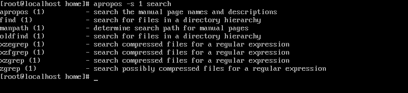

<h3 p align="center" > <i>Forgive me for any grammatical errors, English is not my native language. </i> </h3>

<h2 p align="center" > Find a text in a directory that we do not know where it is. </h2>

## Step 1 - Finding a command with apropos.

 
 - The apropos command serves to locate a command that you do not remember the syntax of, by means of keywords that describe the functionality that this command would have.   

 - We are looking for a command that finds a specific folder.

 

 <i> - Depending on the system you need to update the cache for the apropos command work correctly, the command is <b>"mandb"</b></i>. 

 - We are looking for the "find" command that locates files in a directory hierarchy.  
- But first what does this <b>(1)</b> in front of the "find" command mean? 

 

 - Using the <b>"man" command</b> (which would be the linux manual itself), we find the description of the type of function a given word would have if it had a given number wrapped around the <b>()</b>.

 - This way we look for executable commands, which correspond to the number 1, that our <b>find</b> command has. 

 - For example, we could have the same derivative commands as <b>find</b>, such as <i>find-lib(5) find-ker(9)</i>, but we only need to get executable commands, for this we would use the following "flag" below next to the <b>apropos command</b>.
 

<b><i> - The commands find-lib and find-ker do not exist, I only mentioned them for illustrative purposes.</i></b>

 

 - We will use the -s flag accompanied by the session number we are looking for, in this case session (1) intended for executable commands.

 - The command would be: <b>apropos -s 1 search</b>

 

 - Note that the filtering has become relatively smaller, as now the <b>apropos</b> only passes us the session we have chosen. 

## Passo 2 - Utilizando o comando <b>find</b>  

 - Now that we know which command to use to find a file or directory, let's understand separately how to construct a <b>find command.</b>. 

 - For this example we are looking for a folder called <b>arquivos</b>.</b>. 

 - We have no idea where the folder in question is located, we only know its name and that it is a directory. To locate it we can use the following reasoning: 

 - To find a pen lost in a room, we first need to enter this room. The <b>find</b> command follows this same analogy. 

 - In its syntax we start with the command b>find</b> (search directory), in our example, we will take from the directory / + the flag b>-name</b> which will be where we will put the name of the directory we are looking for, which in turn is the directory b>arquivos.</b>

 - Our command would then be: <b>find / -name "arquivos"</b>

 

 - Here we will talk about two distinct points, the first is the character <b>"?"</b> and the second is the output of our command. 

 - The character <b>?</b>, we can call a wildcard character, it has the function of finding or not any character <b>only</b> in that position. For example, if we were in doubt whether the folder is called <b>"arquivos"</b> or <b>"arquivo"</b> in singular, we could use the wildcard character that would give us any character or none after the word b>arquivo</b>. 

 - The second point is the output of the command, we notice that we have two results, but why is that? Because we should specify the type of file we want to find, otherwise we can either have regular, special or directory files output. 

 - To solve this is simple, just pass the flag <b>-type</b> followed by the <b>parameter d</b> of "directory". 

 - We have finally found our directory, but what if now we still need to find a piece of code text inside this directory that could, for example, be an error? 

## Passo 3 - Using the <b>grep command</b>  

 - The grep command is the key to this search, it alone could solve our task through both absolute and relative path. 

 <i> - Absolute path is the one that is declared from the root of the system identified by / to the place where you want to go. </i> 

 <i> - The relative path is the one that starts from the directory we are currently in. </i> 

 - In this example we have created several folders and files, and each file with its texts inside the directory "/tmp/files". To locate the file in question, I wrote in one of these documents the word "<b>achou</b>". 

 - We can solve this problem as follows: using the command <b>grep</b> + the flag -r (recursive) + the word in question "achou" + the directory path, absolute or relative.

 - This way our command would be: <b>grep -r "achou" /tmp/files/</b>

 - We could have the solution this way, however, we would use two different commands when we can use only one line of code.

## Step 4 - Using the <b>grep</b>, <b>xargs</b> and <b>pipes commands</b>  

 - We will use our find command, using its output as an argument to a new input. 

 

 - Let's talk about our pipe represented by "<b>|</b>". What we are trying to convey with our command is simpler than it seems.

 - We will take the output of the first command which is "find / -type -name file?". Concatenating this output into a new argument with the joins of | + the command <b>xargs</b>. The rest of the grep command follows the same logic described above. 

 - This way our command is: <b>find / -d -name file ? | xargs grep -r "achou"</b>. 

 - In a more simplified summary, we are taking the output of the command <b>find</b> which would be the path <b>/tmp/files/</b> and we are concatenating it with the grep command, and who makes this bridge between both commands transforming the output into an argument is the junction of the pipe | bar with the xargs command. 

 - This command would search recursively from the directory "/tmp/files/" all the files inside it that contain the word "achou". Our output being: b>"/tmp/files/folder3/achou.txt:achou"</b>. 

## Step 5 - Summary  

 - With the apropos command, we can find a command that we do not know through keywords, use the find command to find a file or directory and together with grep we can find within this directory, code snippets that interest us. 

